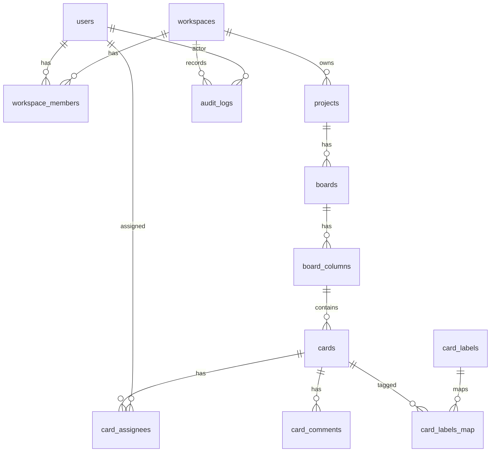

# 数据库设计（DB Schema）

目标：对齐 PRD，支持多租户（workspace）、RBAC、看板列/卡片排序、评论/指派/标签、审计日志。

> 具体字段与约束参考研究报告中的建议实体：
> users, workspaces, workspace_members, projects, boards, board_columns, cards, card_assignees, card_comments, card_labels, card_labels_map, audit_logs

## ER 图（Mermaid）

## 约束/索引关键点（MVP）
- users.email UNIQUE
- workspaces.slug UNIQUE
- workspace_members UNIQUE(workspace_id, user_id)
- board_columns UNIQUE(board_id, position)
- cards UNIQUE(column_id, position)
- card_assignees UNIQUE(card_id, user_id)
- card_labels UNIQUE(workspace_id, name)
- card_labels_map UNIQUE(card_id, label_id)

## 字段约定
- 主键：uuid
- 时间：timestamptz
- 软删除：`archived_at`（project/board/card）
